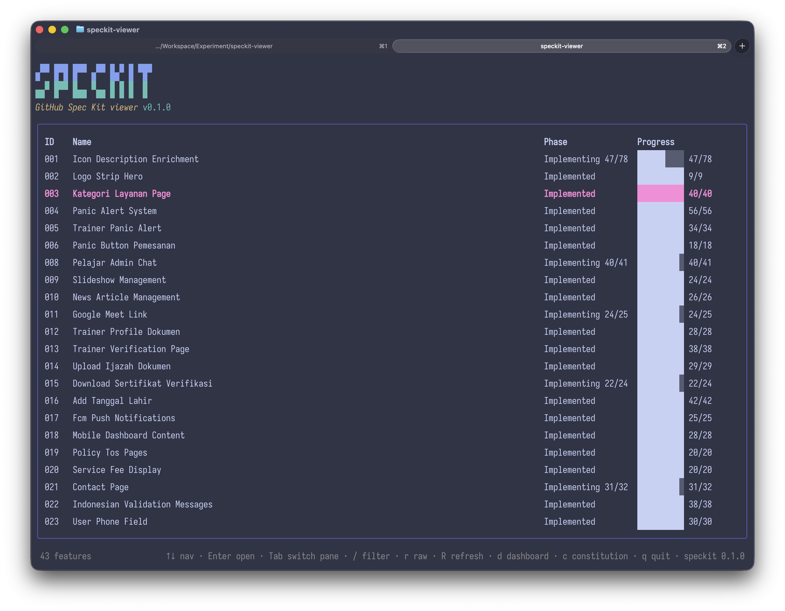
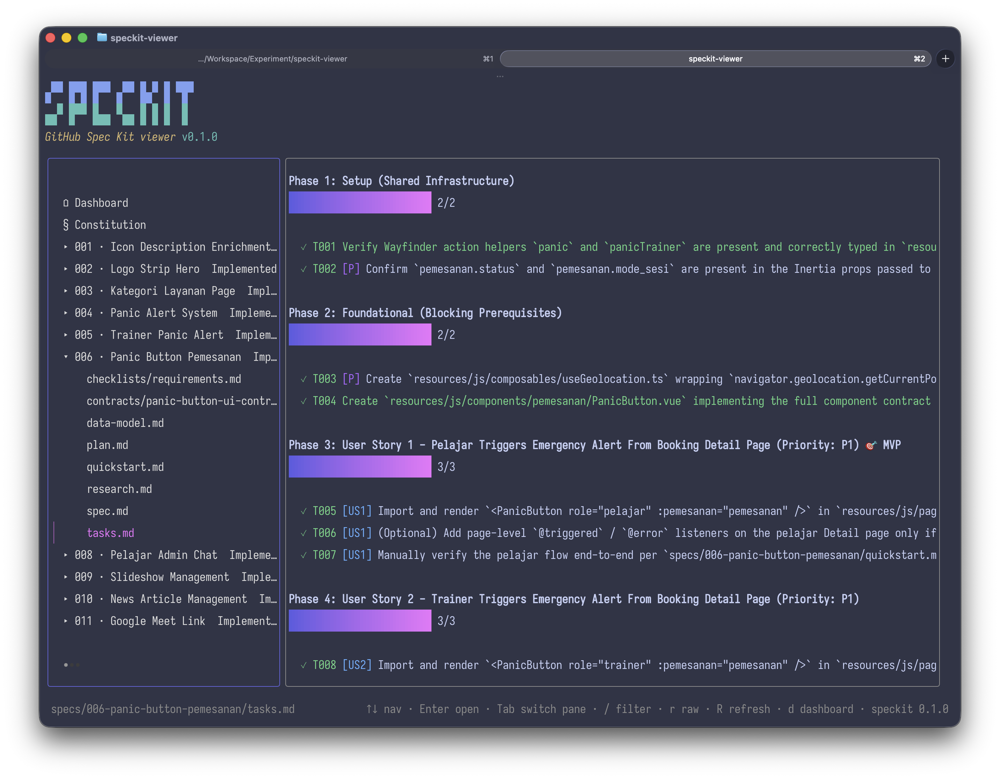

# speckit-viewer

A two-pane terminal dashboard for [GitHub Spec Kit](https://github.com/github/spec-kit) projects.

`speckit` scans a project's `specs/` folder, infers each feature's workflow
phase, and renders every artifact (`spec.md`, `plan.md`, `tasks.md`, …) as
styled Markdown in your terminal.



## Install

**Homebrew** (macOS, Linux):

```sh
brew install khairu-aqsara/tap/speckit
```

**Install script** (macOS, Linux):

```sh
curl -fsSL https://raw.githubusercontent.com/khairu-aqsara/speckit-viewer/main/install.sh | sh
```

Downloads the latest binary for your OS/arch into `/usr/local/bin`. Set
`INSTALL_DIR` to install elsewhere.

**Debian/Ubuntu** (`.deb`) **or Fedora/RHEL** (`.rpm`):

Download the matching package from the
[releases page](https://github.com/khairu-aqsara/speckit-viewer/releases),
then:

```sh
sudo dpkg -i speckit_*.deb   # Debian/Ubuntu
sudo rpm -i speckit_*.rpm    # Fedora/RHEL
```

**Manual download**: grab a binary from the
[releases page](https://github.com/khairu-aqsara/speckit-viewer/releases)
(macOS, Linux, Windows).

**From source**:

```sh
go install github.com/wenkhairu/speckit-viewer@latest
```

## Run

```sh
speckit [path]   # path defaults to the current directory
```

The path must be a Spec Kit project root — a folder that contains `specs/`.

## Screens

- **Dashboard** — one table row per feature: ID, name, inferred phase, and
  task progress. Press Enter to open a feature's `spec.md`.
- **Browse** — a navigator on the left, the rendered file on the right.
  Enter on a feature expands its files; Enter on a file opens it.
- **Checklist** — `tasks.md` opens as a checklist with per-phase progress
  bars. Press `r` to see the raw Markdown instead.



## Phase inference

Spec Kit has no per-feature status field, so the phase comes from which
files exist plus the `tasks.md` checkbox ratio:

| Files present | Phase |
|---|---|
| `spec.md` only | Specified |
| plus `plan.md` / `research.md` / `data-model.md` | Planned |
| plus `tasks.md`, no tasks checked | Tasks Generated |
| some tasks checked | Implementing (`checked/total`) |
| all tasks checked | Implemented |

## Keys

| Key | Action |
|---|---|
| `↑` `↓` | Move in the focused pane |
| `Enter` | Open the selected row |
| `Tab` | Switch pane focus |
| `/` | Filter features by ID or name |
| `r` | Toggle checklist / raw Markdown for `tasks.md` |
| `R` | Re-scan the project (picks up edits made while open) |
| `d` | Dashboard |
| `c` | Constitution (`.specify/memory/constitution.md`) |
| `q` | Quit |

## Notes

- Raw HTML embedded in Markdown renders as literal text.
- Development: `go test ./...` runs the parser, scanner, and phase tests.
